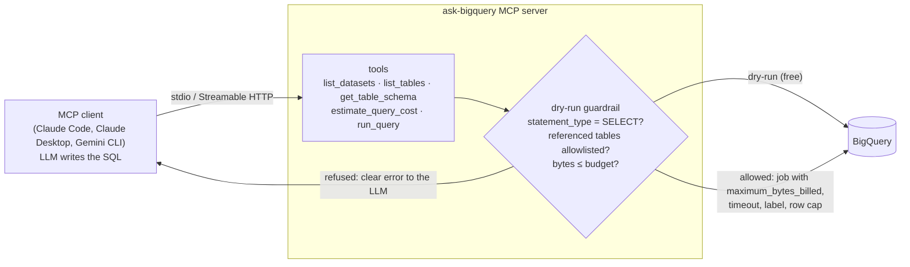

# ask-bigquery

[](https://github.com/batou9150/ask_bigquery/actions/workflows/ci.yml)
[](LICENSE)

**A minimal, read-only BigQuery MCP server, with cost and safety guardrails you can read in one sitting.**
Your MCP client (Claude Code, Claude Desktop, Gemini CLI...) writes the SQL; this server exposes the metadata and runs the queries.
Every query is dry-run first, and runs only if BigQuery itself reports a single `SELECT`, on allowlisted datasets, under a byte budget.

<!-- Demo placeholder: record docs/demo.gif, then uncomment the next line. -->
<!--  -->


```mermaid
flowchart LR
    client["MCP client<br/>(Claude Code, Claude Desktop, Gemini CLI)<br/>LLM writes the SQL"]
    subgraph server["ask-bigquery MCP server"]
        tools["tools<br/>list_datasets · list_tables · get_table_schema<br/>estimate_query_cost · run_query"]
        guard{"dry-run guardrail<br/>statement_type = SELECT?<br/>referenced tables allowlisted?<br/>bytes ≤ budget?"}
    end
    bq[("BigQuery")]
    client -- "stdio / Streamable HTTP" --> tools
    tools --> guard
    guard -- "dry-run (free)" --> bq
    guard -- "refused: clear error to the LLM" --> client
    guard -- "allowed: job with maximum_bytes_billed,<br/>timeout, label, row cap" --> bq
```

## Quickstart (under 5 minutes)

You need [uv](https://docs.astral.sh/uv/), the [gcloud CLI](https://cloud.google.com/sdk/docs/install), and a Google Cloud project to run (and pay for) the queries. Queries on the example dataset scan a few MB; the first TB per month is free.

```bash
gcloud auth application-default login   # the server uses Application Default Credentials

# Check that it installs and runs
uvx --from git+https://github.com/batou9150/ask_bigquery ask-bigquery --help
```

Then add it to your MCP client. The examples use the public `bigquery-public-data.thelook_ecommerce` dataset; replace `my-gcp-project` with your project.

<details open>
<summary><b>Claude Code</b></summary>

```bash
claude mcp add bigquery \
  --env BQ_BILLING_PROJECT=my-gcp-project \
  --env BQ_ALLOWED_DATASETS=bigquery-public-data.thelook_ecommerce \
  -- uvx --from git+https://github.com/batou9150/ask_bigquery ask-bigquery
```

Then ask: *"Which product categories bring in the most revenue?"*, or use the prompt: `/mcp__bigquery__analyze_question`.
</details>

<details>
<summary><b>Claude Desktop</b></summary>

In `claude_desktop_config.json` (Settings → Developer → Edit Config):

```json
{
  "mcpServers": {
    "bigquery": {
      "command": "uvx",
      "args": ["--from", "git+https://github.com/batou9150/ask_bigquery", "ask-bigquery"],
      "env": {
        "BQ_BILLING_PROJECT": "my-gcp-project",
        "BQ_ALLOWED_DATASETS": "bigquery-public-data.thelook_ecommerce"
      }
    }
  }
}
```

If Claude Desktop cannot find `uvx`, use its absolute path (`which uvx`).
</details>

<details>
<summary><b>Gemini CLI</b></summary>

In `~/.gemini/settings.json`:

```json
{
  "mcpServers": {
    "bigquery": {
      "command": "uvx",
      "args": ["--from", "git+https://github.com/batou9150/ask_bigquery", "ask-bigquery"],
      "env": {
        "BQ_BILLING_PROJECT": "my-gcp-project",
        "BQ_ALLOWED_DATASETS": "bigquery-public-data.thelook_ecommerce"
      }
    }
  }
}
```
</details>

From a clone, replace the `uvx --from ...` command with `uv run --project /path/to/ask_bigquery ask-bigquery`.

## Tools

| Tool | What it returns |
|---|---|
| `list_datasets()` | The allowlisted datasets (and only those), with location and description. |
| `list_tables(dataset)` | Tables and views, with description, row count and size. |
| `get_table_schema(dataset, table)` | Columns (type, mode, description, nested fields), partitioning, clustering, and a few sample rows (free `tabledata.list`, no query job). |
| `estimate_query_cost(sql)` | Dry-run: bytes scanned, estimated cost, referenced tables, and whether `run_query` would accept the query, and if not, why. |
| `run_query(sql, max_rows=100)` | Rows, as JSON, after the guardrails; `truncated` tells if rows were cut. |

All tools are annotated `readOnlyHint` and return typed, structured output. The docstrings are written for the LLM: they explain the workflow, how to cut costs (partition filters), and how to read the schema (REPEATED = ARRAY).

One **prompt**, `analyze_question(question)`, walks the LLM through *explore the schema → estimate the cost → run → answer, showing the SQL*.

## Guardrails

This is the point of the repository. The [v1.0](https://github.com/batou9150/ask_bigquery/tree/v1.0) version ran LLM-generated SQL as is, and its README said so. Every guardrail below is in [`guardrails.py`](src/ask_bigquery/guardrails.py) and [`warehouse.py`](src/ask_bigquery/warehouse.py), and tested in [`test_guardrails.py`](tests/unit/test_guardrails.py) and [`test_tools.py`](tests/unit/test_tools.py).

| Threat | Mitigation |
|---|---|
| The LLM (or a prompt injection) writes `DELETE`, `DROP`, `INSERT`, `MERGE`, `CREATE`, `EXPORT DATA`, `GRANT`... | **Read-only, checked by BigQuery, not by regex.** Every query is dry-run first; anything whose `statement_type` is not `SELECT` is refused before it runs. No SQL parsing, so comments, casing or obfuscation tricks don't matter. |
| `SELECT 1; DROP TABLE x` (multi-statement), `CREATE TEMP TABLE ...; SELECT` | BigQuery reports scripts as `statement_type = SCRIPT`, so they are refused like any other non-`SELECT`. |
| Reading data outside the intended scope (another dataset, another project, a same-named dataset in an attacker's project) | **Allowlist** of `project.dataset` (`BQ_ALLOWED_DATASETS`). Every table in the dry-run's `referenced_tables` must belong to it. The metadata tools check it too. |
| Metadata outside the scope: `INFORMATION_SCHEMA.JOBS` (other users' queries), `SCHEMATA`, other datasets' schemas | BigQuery reports region-level views as `<billing-project>.region-us.INFORMATION_SCHEMA.*`, which is not an allowlisted dataset, so they are refused. A dataset-level `INFORMATION_SCHEMA` (e.g. `thelook_ecommerce.INFORMATION_SCHEMA.COLUMNS`) is allowed: it only describes an allowlisted dataset. |
| Queries that reference no table at all (`SELECT 1`) | **Fail closed**: nothing to check against the allowlist, so they are refused. |
| A runaway `SELECT *` on a multi-TB table | **Cost cap**: refused before running if the dry-run estimate exceeds `BQ_MAX_BYTES_BILLED` (1 GB by default), **and** every job carries `maximum_bytes_billed`, so BigQuery itself enforces the cap even if the estimate was wrong. `estimate_query_cost` lets the LLM check and fix a query first. |
| Huge results flooding the LLM context | **Row cap**: `max_rows` (default 100), capped server-side at `BQ_MAX_ROWS`. |
| Long-running jobs | **Timeout**: `job_timeout_ms` on the job, plus a client-side wait timeout (`BQ_JOB_TIMEOUT_S`). |
| Who ran what, and at what cost? | Every job is **labeled** `mcp-server=ask-bigquery`; filter `INFORMATION_SCHEMA.JOBS` or billing exports on it. |
| Stack traces and internals leaking to the LLM; unusable errors | Errors become one clear sentence: `[REFUSED] ...` for a guardrail, `[BIGQUERY_ERROR] ...` with BigQuery's message, minus the request URL (e.g. `Unrecognized name: nope at [1:8]`) so the LLM can fix its query. Unexpected errors return only `Error executing tool <name>`. |
| A bug in all of the above | **IAM as the last line**: on Cloud Run, the service account only has `roles/bigquery.jobUser` on the billing project and `roles/bigquery.dataViewer` on the allowlisted datasets, so it cannot write anything or read anything else. |

What it does **not** protect against, by design:
- **Prompt injection through the data.** Rows returned to the LLM may contain instructions. The guardrails bound what such an instruction can make the server do (read-only, scoped, capped), but not what the LLM does with its other tools.
- **Data exposure to the LLM provider.** Whatever the queries return is sent to the model. Allowlist only datasets you are allowed to share with it.
- **Views and authorized views.** A view in an allowlisted dataset may read tables outside it, if IAM allows it. Allowlist datasets, not intentions.

## Configuration

Environment variables (or a `.env` file, see [`.env.example`](.env.example)):

| Variable | Default | |
|---|---|---|
| `BQ_BILLING_PROJECT` | *required* | Project that runs and pays for the jobs. |
| `BQ_ALLOWED_DATASETS` | *required* | Comma-separated `project.dataset` allowlist. |
| `BQ_LOCATION` | `US` | Location of the jobs. |
| `BQ_MAX_BYTES_BILLED` | `1000000000` | Byte cap per query (dry-run check and `maximum_bytes_billed`). |
| `BQ_MAX_ROWS` | `1000` | Server-side cap on rows returned. |
| `BQ_JOB_TIMEOUT_S` | `60` | Job timeout. |
| `BQ_SAMPLE_ROWS` | `3` | Sample rows in `get_table_schema`; `0` disables them. |
| `BQ_PRICE_PER_TIB_USD` | `6.25` | On-demand price, used only for the estimate. |
| `MCP_TRANSPORT` | `stdio` | `stdio` or `http` (also `--transport`). |
| `HOST` / `PORT` | `127.0.0.1` / `8080` | HTTP bind address (also `--host` / `--port`). |

## Deploy to Cloud Run

Over HTTP, the server speaks stateless [Streamable HTTP](https://modelcontextprotocol.io/specification/2025-06-18/basic/transports#streamable-http) at `/mcp`. On Cloud Run it is a **private** service: Cloud Run's IAM authentication is the access control, and all queries run as one dedicated service account.

```bash
PROJECT_ID=my-gcp-project \
BQ_ALLOWED_DATASETS=bigquery-public-data.thelook_ecommerce \
REGION=europe-west1 \
./deploy.sh
```

[`deploy.sh`](deploy.sh) creates the `ask-bigquery-mcp` service account, grants it `roles/bigquery.jobUser` on the project and `roles/bigquery.dataViewer` on each allowlisted dataset (public datasets need nothing), and runs `gcloud run deploy --source . --no-allow-unauthenticated`. The image ([`Dockerfile`](Dockerfile)) is multi-stage and runs as a non-root user.

To use it from your machine, get `roles/run.invoker` on the service, then open an authenticated tunnel:

```bash
gcloud run services proxy ask-bigquery --region europe-west1 --port 3000
claude mcp add --transport http bigquery http://localhost:3000/mcp
```

(Gemini CLI: `"httpUrl": "http://localhost:3000/mcp"`.) The proxy adds your identity token to each request; nothing is reachable without it.

With the tunnel open, **http://localhost:3000** shows a setup page for the people you share the service with: what the server can access (allowlist, limits), the proxy command, and copy-paste configuration for Claude Code, Gemini CLI and Claude Desktop.

## Development

```bash
uv sync
uv run pytest                 # unit + e2e (BigQuery is faked)
uv run ruff check && uv run ruff format --check && uv run mypy
```

- **Unit tests** call the tools through a real MCP client connected in-process, against a fake BigQuery client. The guardrails come first: DML / DDL / scripts refused, cost cap exceeded, datasets outside the allowlist, nothing executed when refused.
- **E2E tests** start the real entry point as a subprocess and drive it with the MCP SDK client (`list_tools`, then `call_tool`), over stdio and over Streamable HTTP.
- **Integration tests** run against `bigquery-public-data.thelook_ecommerce`; they need ADC and a billing project:
  `BQ_BILLING_PROJECT=my-gcp-project uv run pytest -m integration`

### Eval

[`evals/run_eval.py`](evals/run_eval.py) asks 10 questions about `thelook_ecommerce` ([`questions.yaml`](evals/questions.yaml)) to Claude Code in headless mode (`claude -p`) connected to this server, and checks each answer against a reference SQL query run at the same time (the dataset is regenerated regularly). It is run by hand, not in CI:

```bash
BQ_BILLING_PROJECT=my-gcp-project uv run python evals/run_eval.py --model sonnet
```

<!-- EVAL_RESULTS -->
Last run on 2026-10-04 with Claude Code (`--model sonnet`): **10/10 correct**, about 10 s and $0.07 of LLM usage per question.

| question | expected | answer | ok | turns | time (s) | LLM cost ($) |
|---|---|---|---|---|---|---|
| categories | 26 | 26 | ✅ | 3 | 10.7 | 0.072 |
| distribution_centers | 10 | 10 | ✅ | 3 | 10.4 | 0.066 |
| top_category | Intimates | Intimates | ✅ | 3 | 11.3 | 0.067 |
| jeans_avg_price | 97.85 | 97.85 | ✅ | 3 | 10.1 | 0.066 |
| top_country | China | China | ✅ | 3 | 9.9 | 0.067 |
| female_share | 50.1 | 50.103 | ✅ | 3 | 10.0 | 0.066 |
| returned_orders | 12356 | 12356 | ✅ | 3 | 9.8 | 0.066 |
| top_traffic_source | Search | Search | ✅ | 3 | 9.9 | 0.067 |
| revenue_2023 | 297613.0 | 297613.11 | ✅ | 3 | 10.5 | 0.067 |
| top_distribution_center | Chicago IL | Chicago IL | ✅ | 3 | 10.2 | 0.069 |

Every question took 3 turns: the model often writes the query straight away, since `thelook_ecommerce` is a well-known public dataset. On your own data, expect it to call `list_tables` and `get_table_schema` first, as the `analyze_question` prompt asks.
<!-- /EVAL_RESULTS -->

## Why not the official Google BigQuery MCP?

Use it if it fits: Google offers a [managed BigQuery MCP server](https://docs.cloud.google.com/bigquery/docs/use-bigquery-mcp) and [MCP Toolbox for Databases](https://github.com/googleapis/genai-toolbox), which cover far more ground and are maintained by Google.

This repository does not try to replace them. It is a **minimal, readable reference**: about 500 lines of Python, which you can audit in one sitting and fork. Its read-only and cost guardrails are explicit, enforced from BigQuery's own dry-run, and tested one by one. It is meant as a starting point when you want to know, and decide, exactly what an LLM can do to your data warehouse.

## Not in scope

- OAuth 2.1 authorization, Dynamic Client Registration, PKCE
- Propagating the end user's identity to BigQuery (e.g. Workforce Identity Federation): all queries run as the server's identity
- Multi-tenancy
- Full infrastructure as code (Terraform): one deploy script is enough here

## History

Until [v1.0](https://github.com/batou9150/ask_bigquery/tree/v1.0), this repository was a Streamlit + LangChain text-to-SQL app that sent LLM-generated SQL straight to BigQuery. v2 is a rewrite as an MCP server: the LLM moves to the client, and the server becomes the guardrail.

Built with the official [MCP Python SDK](https://github.com/modelcontextprotocol/python-sdk) (v2, `MCPServer`, formerly `FastMCP`) and [google-cloud-bigquery](https://github.com/googleapis/python-bigquery).

## License

[MIT](LICENSE)
