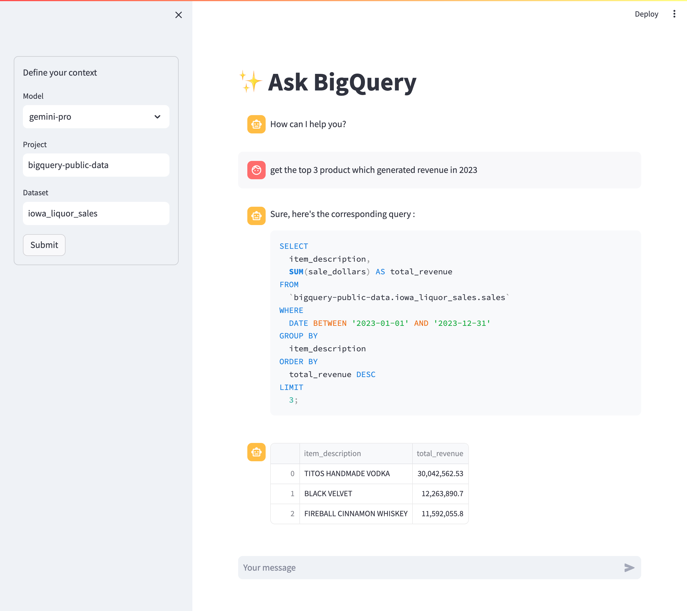

# ✨ Ask BigQuery

Ask your BigQuery data any question in natural language from a chat interface.



Built with [Streamlit](https://github.com/streamlit/streamlit), [LangChain](https://github.com/langchain-ai/langchain) & [VertexAI](https://cloud.google.com/vertex-ai/).

Inspired by: 
- Google Cloud Blog [Integrating BigQuery data into your LangChain application](https://cloud.google.com/blog/products/ai-machine-learning/open-source-framework-for-connecting-llms-to-your-data?hl=en) and the corresponding [notebook](https://github.com/GoogleCloudPlatform/generative-ai/blob/main/language/orchestration/langchain/langchain_bigquery_data_loader.ipynb)
- [BigFunctions](https://github.com/unytics/bigfunctions) with the [ask_my_data](https://unytics.io/bigfunctions/bigfunctions/#ask_my_data) BigQuery UDF

Disclaimer:
- this product is at the experimental stage
- this product is based on Generative AI technologies and may be subject to occasional hallucinations, producing outputs that may deviate from intended patterns or contain unexpected elements
- this product does not contains any protection regarding prompt injections, and therefore against sql injections

## install

```bash
pip install -r requirements.txt
```

## run

```bash
streamlit run ./ask_bigquery/main.py
```
